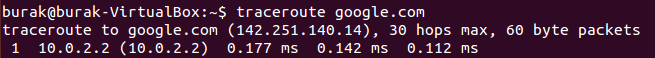

# How to Create Your Own Linux Command

You can create your own custom Linux command by following these simple steps:

1. Use the `nano` text editor to create a new shell script file named `networkdemo.sh` in your home directory:
    ```bash
    nano ~/networkdemo.sh
    ```

2. Make the shell script executable by changing its permissions:
    ```bash
    chmod +x ~/networkdemo.sh
    ```

3. Move the shell script to the `/usr/bin` directory to make it accessible system-wide:
    ```bash
    sudo mv ~/networkdemo.sh /usr/bin/networkdemo
    ```

## Example Shell Script

Below is an example shell script (`networkdemo.sh`) that provides a simple menu for performing network-related tasks:

```bash
#!/bin/bash

echo "1. Ping"
echo "2. Send HTTP GET Request"
echo "3. Perform DNS Query"
echo "4. Exit"

read -p "Please select an option: " option

case $option in
    1)
        read -p "Enter the address to ping: " address
        ping -c 4 $address
        ;;
    2)
        read -p "Enter the URL to send HTTP GET request: " url
        curl -I $url
        ;;
    3)
        read -p "Enter the URL for DNS query: " url
        nslookup $url
        ;;
    4)
        echo "Exiting..."
        exit 0
        ;;
    *)
        echo "Invalid option! Exiting the program..."
        exit 1
        ;;
esac
```


# Basic Networking Linux Commands
| Command                  | Description                                                 | Image |
|--------------------------|-------------------------------------------------------------|-------|
| ifconfig                 | Checks your network interfaces.                             |      |
| traceroute google.com    | It's like your computer sending out little breadcrumbs to Google, hoping to find its way home. |  |
| ping google.com          | Checks if Google is reachable.                              |
| nslookup                 | Finds IP addresses from domain names.                       |
| curl -I                  | Gets just the HTTP header of a URL.                         |
| ping -c 4 $address       | Sends four pings to an address.                             |
| httpie                   | A simple HTTP client.                                       |
| wget                     | Downloads files from the web.                               |
| tc                       | Controls traffic in Linux.                                  |
| dig            | Looks up DNS information.                                   |
| whois                    | Checks domain registration info.                            |
| ssh                      | Imagine your computer, sneaking into an exclusive VIP party with its own secret handshake. |
| scp                      | Securely copies files between hosts.                        |
| rsync                    | Efficiently syncs files and directories.                    |
| ngrep                    | Searches network traffic.                                   |
| tcpdump                  | Captures and analyzes network packets.                      |
| wireshark                | Analyzes network protocols.                                 |
| tshark                   | Command-line version of Wireshark.                          |
| tcpflow                  | Captures and stores TCP data.                               |
| route                    | Manages IP routing tables.                                  |
| ip                       | Handles IP addresses and routes.                            |
| arp                      | Manages the ARP cache.                                      |
| mitmproxy                | Interactive HTTPS proxy.                                    |
| nmap                     | Scans for open ports and services.                          |
| zenmap                   | GUI for Nmap.                                               |
| openvpn                  | VPN solution.                                               |
| ftp/sftp                 | File transfer protocols.                                    |
| iptables                 | Controls IPv4 packet filtering.                             |
| mtr           | Traces packet routes.                                       |
| openssl                  | Handles secure communications.                              |


